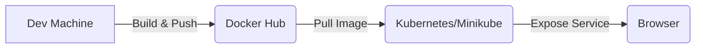

# 🚀 Deploying Docker + Minikube + Kubernetes (Hello World App)

This guide walks through building a static Nginx-based Docker app, pushing it to Docker Hub, and deploying it on Kubernetes using **Minikube**.

---

## **📂 Project Structure**

After cloning/downloading, your project looks like this:

```powershell
PS C:\Users\Priyanka\Downloads\docker-hello-world> tree
Folder PATH listing for volume Windows
Volume serial number is FC4F-C12D
C:.
├───html
│       index.html
├───k8s
│       deployment.yaml
│       service.yaml
├── docker-compose.yml
├── Dockerfile
└── README.md
```

---

## **1. Install & Start Minikube**

Run in **PowerShell (Admin)**:

```powershell
choco install minikube
minikube status
minikube start
```

---

## **2. Build & Run Docker Image**

**Dockerfile**

```dockerfile
FROM nginx:alpine
COPY html /usr/share/nginx/html
EXPOSE 80
```

**Build image:**

```bash
docker build -t priyanka4316/docker-hello-world .
```

**Run container locally:**

```bash
docker run -d -p 80:80 priyanka4316/docker-hello-world
```

Open in browser 👉 [http://localhost:80](http://localhost:80)

---

## **3. Application Code**

**`html/index.html`**

```html
<!doctype html>
<html>
  <head><meta charset="utf-8"><title>Hello from Docker</title></head>
  <body style="font-family: system-ui; text-align:center; margin-top:10vh;">
    <h1>🚀 Hello, Cloudnautic!</h1>
    <p>Nginx static site running inside Docker.</p>
  </body>
</html>
```

---

## **4. Push Image to Docker Hub**

```bash
docker push priyanka4316/docker-hello-world
```

---

## **5. Deploy to Kubernetes**

### Deployment (`k8s/deployment.yaml`)

```yaml
apiVersion: apps/v1
kind: Deployment
metadata:
  name: hello-web
spec:
  replicas: 2
  selector:
    matchLabels: { app: hello-web }
  template:
    metadata:
      labels: { app: hello-web }
    spec:
      containers:
        - name: nginx
          image: priyanka4316/docker-hello-world:latest
          ports: [{ containerPort: 80 }]
```

### Service (`k8s/service.yaml`)

```yaml
apiVersion: v1
kind: Service
metadata:
  name: hello-web-svc
spec:
  type: NodePort
  selector: { app: hello-web }
  ports:
    - port: 80
      targetPort: 80
      nodePort: 30080
```

### Apply configs:

```bash
kubectl apply -f k8s/deployment.yaml
kubectl get pods
kubectl get deployments

kubectl apply -f k8s/service.yaml
kubectl get service
```

---

## **6. Access App via Minikube**

Start dashboard:

```bash
minikube dashboard
```

Get Minikube IP:

```bash
minikube ip
```

Open in browser:
👉 `http://<minikube-ip>:30080`

Example:

```
http://192.168.49.2:30080
```

---

✅ **Done!**
You now have:

* Static website served via **Nginx**
* Containerized using **Docker**
* Image hosted on **Docker Hub**
* Deployed and exposed in **Kubernetes (Minikube)**

---

## **Diagram: Flow Overview**



---

